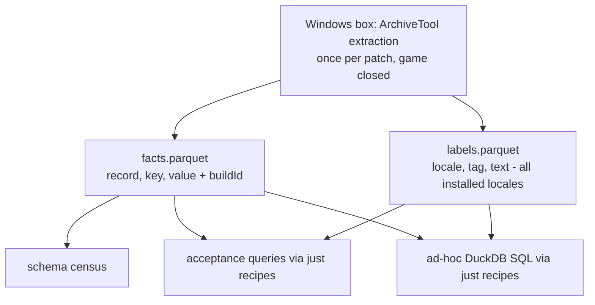

# Item Data Raw Deposit - Plan

## Goal Capsule

- **Objective:** Produce a lossless, language-free, queryable deposit of all Grim Dawn game records plus per-locale label tables, generated and inspected entirely through repeatable `just` recipes, as the durable foundation for an item-database site and other future work.
- **Product authority:** Ted's brainstorm dialogue (2026-07-03) and the ideation record at `docs/ideation/2026-07-03-item-data-extraction-ideation.html` (idea 1, "Raw deposit + schema census + query-first spine").
- **Open blockers:** None. The deposit-home decision (committed here vs separate repo/release assets) is intentionally made in-flow from the measured size report (R11).

---

## Product Contract

### Summary

Extract the entire `records/` tree into a long-format `(record, key, value)` facts table plus a `(locale, tag, text)` labels table for every installed locale, both stamped with the Steam build id. Every artifact is rebuilt by `just` recipes; DuckDB inspection recipes — including named acceptance queries that prove the target filter model — are the way the data is examined. No UI is built.

### Problem Frame

The extraction pipeline already pulls 61,530 DBR files (18,738 of them items) out of the game archives but only parses devotions; item schema complexity — hundreds of sparse stat keys, min/max pairs, flag families, cross-record references — is currently a fear rather than a measured fact. Every schema experiment today requires the Windows-only ArchiveTool step with the game closed, which chains iteration to one machine. Meanwhile the reference item database (grimtools.com/db) cannot combine filters: type, rarity, faction, and text search are mostly mutually exclusive, so questions like "components with Cold usable at level 20+" cannot be asked at all. Before any site or canonical schema is designed, the data needs to be out, queryable anywhere, and measured.

### Key Decisions

- **Deposit the entire `records/` tree, not just `items/`.** Item records reference skills, sets, pet bonuses, and loot-affix pools outside `items/`; a full-tree deposit makes those hops queryable day one, avoids future re-scoping, and brings devotions into the same table for free.
- **Lossless long format; no typed schema yet.** The facts table preserves every key of every record as `(record, key, value)` rows. Normalization, typing, and curation are downstream SQL over the deposit, not parser logic — a wrong curation call costs a re-run of a view, not a Windows extraction cycle.
- **Language-free facts, labels as data.** DBR text fields store tags, never display text, so the facts table carries no English. Localized display and text search are a join against the labels table; the active-locale-then-English fallback is a `COALESCE`. Labels cover the full per-locale tag tables, unfiltered — filtering to referenced tags is a web-payload optimization that does not apply to an analyst artifact.
- **The justfile is the only interface.** Generation (extract, deposit, census) and inspection (acceptance queries, ad-hoc SQL) are all `just` recipes. No artifact exists that a recipe cannot regenerate; no inspection requires leaving the terminal.
- **Deposit home is decided by measurement.** The first run reports artifact sizes. Small enough: committed to this repo like `devotions.json`. Large: a separate repo/tool (possibly its own SPA later) or release assets, keeping this repo lean. The emitter stays self-contained so it can lift out cleanly.



### Requirements

**Deposit generation**

- R1. The deposit contains one facts row per `(record, key, value)` occurrence for every record under the extracted `records/` tree, with nothing dropped — including duplicate keys within a record, preserved in file order.
- R2. Every deposit artifact is stamped with the Steam build id it was extracted from.
- R3. A labels table carries `(locale, tag, text)` for the full tag tables of every installed locale (currently 13); a locale whose text archive is missing is warned about and reported, not silently omitted.
- R4. A single `just` recipe chain regenerates the deposit artifacts (facts, labels, meta) from an extracted tree; re-running after a game patch requires no code changes. The census derives from the deposit separately via its own recipe, also with no code changes.
- R5. Only archive extraction requires Windows with the game installed; every downstream step (deposit inspection, census, schema iteration) runs on any OS from the deposit alone.

**Census**

- R6. A schema census derived from the facts table reports, per record category: distinct keys, value type shapes, non-zero frequency, cardinality, and template usage.
- R7. The census output identifies weakly-modeled categories (such as enemy gear, quest items, faction items) with enough detail to decide which categories future typed schemas include.

**Inspection and acceptance**

- R8. `just` recipes run DuckDB queries against the deposit, including a recipe that accepts arbitrary SQL.
- R9. Named acceptance-query recipes prove the target filter model: OR within a facet group, AND across groups, numeric range conditions, and an ANDed text match against localized labels.
- R10. At least one acceptance query matches label text in a non-English locale.
- R11. The generation run reports the size of each artifact, and the deposit-home decision (committed here vs separate repo/release assets) is recorded once those numbers exist.

### Acceptance Examples

- AE1. **Covers R8, R9.** Given the deposit and English labels, when the "Cold components" recipe runs, then it returns components whose localized name or description contains "Cold" and whose level requirement is 20 or greater, with human-readable names in the output.
- AE2. **Covers R9.** Given the deposit, when the compound-facet recipe runs (item class in {one-handed sword, dagger} AND rarity in {epic, legendary} AND a lightning-damage stat present), then it returns only rows satisfying all three groups, demonstrating OR-within-group and AND-across-groups.
- AE3. **Covers R10.** Given German labels, when the non-English recipe runs with a German search term, then matches come from `de` label text and fall back to English for tags missing in `de`.
- AE4. **Covers R4.** Given a freshly patched game and a re-extracted tree, when the generation chain re-runs, then all artifacts regenerate with the new build id and the acceptance recipes still pass without code changes.

### Success Criteria

- Ted can answer real item questions from the terminal in one command, without touching grimtools.
- The acceptance queries return results Ted verifies as sane against in-game knowledge.
- The size report exists and the deposit-home decision is made and recorded.

### Scope Boundaries

- **Deferred for later:** the filter UI/site (the Destiny-vault-style button surface is the north star for query shapes, not a deliverable here); the typed canonical schema (entities/stats/edges tables); stat display labels for raw stat ids; public versioned dataset releases with balance diffs; the browser engine bake-off.
- **Not goals here:** deduplicating with `devotions.json` (the app keeps its own committed dataset; the deposit is an analyst artifact — devotion data intentionally exists in both), replacing the existing devotions extraction flow, and any change to the shipped planner.

### Dependencies / Assumptions

- A Windows machine with Grim Dawn installed remains available for the per-patch extraction step; the existing `just extract` flow (game closed, expansions auto-discovered) is reused as-is.
- The full-tree facts deposit covers 61,530 DBR files (818 MB raw text); parquet with zstd compression is assumed to keep the artifacts manageable, but the size gate (R11) exists precisely because this is unmeasured until the first run.
- Item-level text search is assumed to work via name/description tags resolved through labels; if some searchable text turns out not to be tag-addressed, that surfaces in the census and becomes a follow-up concern.
- Template (`.tpl`) inheritance is not represented: the deposit carries raw `.dbr` content only, so template-inherited defaults are absent. The census reports template usage so the gap is visible; resolving inheritance is future work.

### Outstanding Questions

- None blocking. Toolchain, value typing, and recipe shape were resolved during planning (see Key Technical Decisions).

---

## Planning Contract

**Product Contract preservation:** changed R1 (sharpened: duplicate keys within a record are preserved in file order — strengthens losslessness) and R3 (clarified: locale coverage is discovery-based over installed `Text_*.arc` archives, warn-and-report on gaps). Both were confirmed by Ted in the plan scoping synthesis. All other Product Contract text and IDs are unchanged.

### Key Technical Decisions

- **KTD1. All deposit tooling runs via uv with the `duckdb` Python package; no DuckDB CLI dependency.** The dev box has uv 0.11.21 and no `duckdb` binary; `just parse` already runs through `uv run`. New scripts use the repo's uv-shebang convention with `duckdb` as a script dependency, covering parquet writing (`COPY ... TO ... (FORMAT parquet, COMPRESSION zstd)`) and all query execution. No global installs.
- **KTD2. Order-preserving reader; facts schema `(record, idx, key, value, value_num)`.** `read_dbr` returns a dict, which silently collapses duplicate keys — a losslessness violation (R1). The deposit uses a new reader that yields every `key,value` line in file order with an occurrence index. `value` keeps the raw text; `value_num` is a best-effort DOUBLE (NULL when non-numeric) so range queries work without a typing pass. Multi-value cells (semicolon/comma-packed arrays) stay raw in `value`; exploding them is downstream SQL.
- **KTD3. One generation run stamps everything with one build id.** Facts, labels, and a small meta table (build id, game version, generation timestamp, file/row counts, locale coverage) are emitted by the same run. Inspection recipes read meta and warn when facts and labels carry different build ids.
- **KTD4. Deposit path behind a single justfile variable; gitignored pending the size gate.** Artifacts land in `data/deposit/` (gitignored) until R11's numbers decide the home. Every recipe resolves the location through one variable so relocation — including to a separate repo — is a one-line change. `just clean` never deletes deposit artifacts (Windows-only to regenerate); a separate `clean-deposit` recipe does.
- **KTD5. Census categorizes by directory path; templateName is a reported metric.** Category derives from the record path prefix — one unambiguous taxonomy for the R7 scoping report. Each category's entry includes its template-usage distribution (also the visible face of the `.tpl` inheritance gap); a template-based grouping stays one `GROUP BY` away in SQL if path grouping proves too coarse. The census also carries data-quality diagnostics: dangling cross-references (referenced `.dbr` paths absent from the deposit) and zero-row files.
- **KTD6. Acceptance recipes fail loudly.** A named acceptance query returning zero rows exits non-zero — an empty result is ambiguous between "correctly nothing" and "broken join", and these recipes exist to prove the filter model. Recipes print row counts. A missing deposit produces an explicit error pointing at the generation recipe, mirroring `parse_devotions.py`'s existing stderr guidance pattern.
- **KTD7. AE queries may hardcode raw stat ids.** Raw stat ids (`offensiveLightningMin`, `levelRequirement`, ...) are the deposit's schema by design; acceptance queries name them as literals. Mapping them to display labels is the deferred stat-label work, not a prerequisite.

### High-Level Technical Design

Directional sketch of the deposit tables and how the acceptance queries join them (guidance, not implementation specification):

```
facts                              labels                       meta
------------------------------     -------------------------    -------------------
record    VARCHAR  (rel path)      locale  VARCHAR              key      VARCHAR
idx       INTEGER  (line order)    tag     VARCHAR              value    VARCHAR
key       VARCHAR                  text    VARCHAR              (buildid, game_version,
value     VARCHAR                                                generated_utc, counts,
value_num DOUBLE   (NULL if NaN)                                 locales_built, ...)

-- AE1 shape: facets AND range AND localized text
SELECT ...
FROM facts item
JOIN facts nametag ON nametag.record = item.record AND nametag.key = 'itemNameTag'
JOIN labels l ON l.tag = nametag.value AND l.locale = 'en'
WHERE item.record LIKE 'records/items/materia%'        -- facet: category
  AND EXISTS (level requirement >= 20 via value_num)   -- range
  AND l.text ILIKE '%cold%'                            -- text AND
```

The generation flow is the mermaid diagram in the Product Contract; the census and acceptance layers are pure SQL consumers of these three tables.

---

## Implementation Units

### U1. Deposit emitter: facts.parquet plus meta

- **Goal:** A uv-shebang script and `just deposit` recipe that walk the extracted `records/` tree and emit `facts.parquet` and the meta table, losslessly and re-runnably.
- **Requirements:** R1, R2, R4, R5, R11 (size numbers produced here).
- **Dependencies:** None (extracted tree already exists via `just extract`).
- **Files:** `scripts/build_deposit.py` (new), `justfile` (new `deposit` recipe + deposit-path variable), `.gitignore` (add `data/deposit/`).
- **Approach:** New order-preserving line reader (same first-comma split as `read_dbr`, but yielding every line in order with an occurrence index — do not reuse the dict-based `read_dbr`). Record relative paths are normalized to forward slashes (same as `write_duckdb_csv` at `scripts/parse_devotions.py:711`) so the `record` column matches the forward-slash form DBR reference values use — the path-prefix facet queries and KTD5's dangling-reference join depend on both sides being forward-slash. Stream rows into DuckDB, `COPY TO` parquet with zstd. Stamp meta from the same buildid capture pattern `just parse` uses (`justfile:151-162`). Print a generation summary: files scanned, zero-row files, total rows, artifact sizes. The script is self-contained (no imports from `parse_devotions.py` beyond, at most, shared trivial helpers) so it can lift to a separate repo if the size gate says so.
- **Execution note:** Smoke-first — prove the recipe end-to-end on the real extracted tree early; the devotion-subset oracle below is the correctness anchor.
- **Patterns to follow:** uv-shebang + inline dependencies (`scripts/build_game_tables.py:1-7`); ABOUTME header convention; `just parse` recipe shape for buildid capture and argument passing; the validation-report style of `parse_devotions.py` for the generation summary.
- **Test scenarios:**
  - Happy path: running `just deposit` on the extracted tree produces `facts.parquet`, meta, and a summary whose file count equals the filesystem `.dbr` count (61,530 at current build).
  - Oracle cross-check: for the devotion subset (`records/skills/devotion/`, `records/ui/skills/devotion/`), row count and key/value content match `devotion_records.csv` from `just parse --duckdb` (allowing for the new `idx` column and duplicate-key rows).
  - Duplicate keys: a fixture `.dbr` with a repeated key yields one row per occurrence with distinct `idx` values.
  - Edge: an empty/comment-only `.dbr` emits zero rows and is counted in the summary's zero-row diagnostic.
  - Edge: `value_num` is NULL for non-numeric values and populated for `6.000000`-style numerics.
  - Re-run determinism: running `just deposit` a second time on the same extracted tree produces identical facts and labels content; only the generation timestamp in meta differs.
  - Error path: running against a missing/empty extracted tree exits non-zero with guidance to run `just extract`.
- **Verification:** `just deposit` completes on the real tree; summary counts reconcile with the filesystem; the devotion oracle query returns zero mismatches; artifact sizes printed.

### U2. Labels emitter: labels.parquet for every installed locale

- **Goal:** Emit `labels.parquet` with the full `(locale, tag, text)` tag tables for every extracted language, stamped consistently with the facts run.
- **Requirements:** R3, R2, R4.
- **Dependencies:** U1 (meta/stamping and script scaffold).
- **Files:** `scripts/build_deposit.py` (labels stage or subcommand), `justfile` (wire into `deposit`).
- **Approach:** Discover locales from `extracted/text_*/` (the directories `just i18n-tables` already produces), read each with the parser's `load_translations`, and emit all tags unfiltered — deliberately not `collect_referenced_tags`, which is the web-payload filter. Report per-locale tag counts; warn and continue when a locale directory is missing or empty, listing gaps in the summary (R3). Also warn when any `extracted/text_*` directory is older than `extracted/records` — `just extract` refreshes only records and English text, so after a patch the other locales are stale until `just i18n-tables` re-runs; the documented refresh flow is `just extract` then `just i18n-tables` then `just deposit`.
- **Patterns to follow:** `scripts/build_game_tables.py` (locale handling, `load_translations` reuse, per-key English fallback semantics stay a query-time concern).
- **Test scenarios:**
  - Happy path: all 13 currently-extracted locales appear in `labels.parquet`; per-locale tag counts are within the same order of magnitude as `extracted/text_en`'s tag count.
  - Localized join: a known tag (e.g., a devotion constellation name tag) resolves to different text in `en` and `de`.
  - Edge: removing one locale directory from a test copy produces a warning naming that locale, a successful run, and a coverage list in the summary.
  - Fallback shape: a `COALESCE(de.text, en.text)` query returns English for a tag present in `en` but absent in `de`.
- **Verification:** locale coverage in meta matches `extracted/text_*` on disk; the localized-join query shows distinct per-locale text.

### U3. Schema census

- **Goal:** A `just census` recipe that turns the facts table into the decision-making report R6/R7 describe.
- **Requirements:** R6, R7.
- **Dependencies:** U1.
- **Files:** `scripts/build_deposit.py` (census subcommand) or `scripts/deposit_census.sql`-style query assets, `justfile` (`census` recipe).
- **Approach:** Pure SQL over facts: per path-prefix category (the single taxonomy, KTD5) report distinct keys, type shape (numeric vs text via `value_num`), non-zero frequency, cardinality, and template-usage distribution. Include diagnostics: dangling references (values that look like `records/...dbr` paths with no matching record in facts), zero-row file count (from meta), per-category record counts. Output as terminal summary plus a written report file next to the deposit.
- **Test scenarios:**
  - Happy path: census runs and every `records/items/` subdirectory appears as a category with plausible counts (items total 18,738).
  - Diagnostics: dangling-reference count is reported (and spot-checking one reported dangler confirms the target file is genuinely absent).
  - R7 signal: the report distinguishes at least the known weakly-modeled categories (enemy gear, quest items, faction) by key-coverage difference from mainline gear.
- **Verification:** Ted can answer "which categories are in scope for a typed schema" from the report alone — the R7 test.

### U4. Inspection and acceptance recipes

- **Goal:** The terminal query surface: ad-hoc SQL plus named acceptance recipes that prove the filter model and fail loudly.
- **Requirements:** R8, R9, R10.
- **Dependencies:** U1, U2.
- **Files:** `justfile` (`q` recipe taking a SQL argument; named acceptance recipes), `scripts/build_deposit.py` (query runner subcommand) or a small query-runner script, acceptance SQL kept as readable assets.
- **Approach:** `just q "SELECT ..."` streams results as a table. Named recipes implement AE1 (Cold components, level ≥ 20, English labels), AE2 (class OR-group AND rarity OR-group AND lightning stat present — raw stat-id literals per KTD7), AE3 (German search term with English fallback). Each prints its row count and exits non-zero on zero rows (KTD6). All recipes check deposit existence first and error with run-this-first guidance; they read meta and warn on facts/labels build-id mismatch (KTD3).
- **Execution note:** These recipes are the feature's acceptance tests — treat AE1-AE3 passing against the real deposit as the definition of working, not unit coverage.
- **Test scenarios:**
  - Covers AE1. The Cold-components recipe returns a non-empty, sane result with localized names.
  - Covers AE2. The compound-facet recipe returns only rows satisfying all three groups; spot-check one returned item in-game or on grimtools.
  - Covers AE3. The German recipe matches `de` text; a tag missing from `de` falls back to English in the same query.
  - Error path: with `data/deposit/` absent, every recipe exits non-zero with guidance, not a stack trace.
  - Error path: a deliberately impossible named query (e.g., nonsense search term via the ad-hoc recipe) demonstrates the zero-row failure behavior.
- **Verification:** all named acceptance recipes exit 0 against the real deposit; `just q` handles an arbitrary join across facts and labels.

### U5. Size gate, docs, and home decision

- **Goal:** Close the loop: record the measured sizes, make and record the deposit-home decision, and document the new surface.
- **Requirements:** R11, R4 (documented refresh flow).
- **Dependencies:** U1, U2, U3, U4.
- **Files:** `docs/deposit.md` (new living doc: artifacts, schema, recipes, the refresh-after-patch flow — `just extract`, then `just i18n-tables`, then `just deposit` — and known limitations incl. `.tpl` inheritance), `README.md` or `ONBOARDING.md` (pointer), `justfile` (`clean-deposit`; confirm `clean` leaves deposit alone), `.gitignore` or git tracking flip per the decision, `BACKLOG.md` (carry the deferred ideas: typed schema, edges, stat labels, releases, engine bake-off — with pointers to the ideation doc).
- **Approach:** Present Ted the measured sizes with a recommendation (commit here vs separate repo/release assets per the brainstorm's decision rule); record the outcome in `docs/deposit.md`. Keep the doc evergreen per repo convention (no changelog sections).
- **Test expectation:** none — documentation and wiring; verified by the Definition of Done checks.
- **Verification:** `just clean` followed by inspection recipes still works (deposit untouched); `docs/deposit.md` lets a fresh reader run the whole flow; the home decision is written down with its numbers.

---

## Verification Contract

| Gate | Command | Pass signal |
|---|---|---|
| Full regeneration | `just deposit` (on the Windows box, after `just extract` and `just i18n-tables`) | Completes; summary file count matches filesystem `.dbr` count; sizes printed |
| Devotion oracle | oracle query via `just q` | Zero mismatches vs `devotion_records.csv` for the devotion subset |
| Census | `just census` | Report produced; categories and diagnostics present (R6/R7) |
| Acceptance | named acceptance recipes (AE1, AE2, AE3) | All exit 0 with non-zero row counts |
| Cross-platform inspection | `just q "..."` on a non-extraction machine (or with `GD_DIR` unset) | Queries run from deposit alone (R5) |
| Existing pipeline unharmed | `just check` | Passes; devotions app build/tests unaffected |

---

## Definition of Done

- `facts.parquet`, `labels.parquet`, and meta exist, regenerate via one recipe chain, and carry the Steam build id.
- All named acceptance recipes pass against the real deposit; AE1-AE3 verified sane by Ted. AE4 (re-run after a real game patch) is verified on the next patch cycle, not a gate for this work — its mechanical core is covered now by U1's re-run determinism scenario.
- The census report exists and answers the category-scoping question (R7).
- Size numbers are recorded and the deposit-home decision is documented in `docs/deposit.md`.
- `just clean` leaves the deposit intact; `clean-deposit` removes it; `just check` still passes.
- Deferred follow-ups (typed schema, edges table, stat labels, releases, engine bake-off) are captured in `BACKLOG.md` with pointers to the ideation record.

---

## Sources & Research

- `docs/ideation/2026-07-03-item-data-extraction-ideation.html` — ranked ideation record; this plan implements idea 1.
- `scripts/parse_devotions.py` — `read_dbr` / `write_duckdb_csv` precedents (`:699`, `:745`); duplicate-key limitation motivating KTD2; validation-report pattern.
- `scripts/build_game_tables.py` — uv-shebang convention, `load_translations` reuse, locale handling.
- `justfile` — extraction guard (`:106-115`), buildid provenance (`:151-162`), `i18n-tables` per-locale extraction and ArchiveTool gotchas (`:182-218`), `clean` keep-list.
- `docs/dbr-format.md` — DBR parsing rules; "keys drift across patches"; tags-not-text rule.
- Measured this session: 61,530 `.dbr` files / 818 MB under `extracted/records`; 13 locales extracted under `extracted/text_*`; uv 0.11.21 present; no DuckDB CLI.
