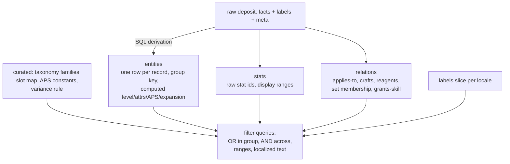
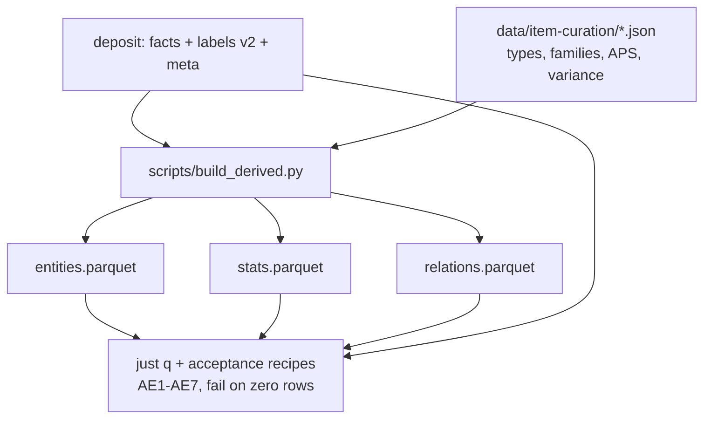

# Typed Item Schema - Plan

## Goal Capsule

- **Objective:** Define and build the typed, current-build-only parquet contract for the Grim Dawn item database: entity, stat, and relationship tables derived from the raw deposit by SQL alone, sized and shaped for client-side DuckDB-WASM querying in a backend-less GitHub Pages SPA.
- **Product authority:** Ted's brainstorm dialogue (2026-07-03), the grimtools screenshots he supplied as oracles (Sacrificial Knife card, legendary two-handed axes list, helms prefix/suffix tabs), and the raw-deposit artifacts (`docs/deposit.md`, `data/deposit/census.md`).
- **Open blockers:** None.

---

## Product Contract

### Summary

Derive typed parquet tables from the raw deposit: one entity row per game record with a variant group key, complete raw stats plus a curated filter taxonomy riding on top, relationship tables for applies-to / crafts / set membership / granted skills, and computed display fields (required level and attributes, roll ranges, attack speed, expansion). The tables are the data contract for a Vault-Zero-style compound-filter UI organized as browse domains.

### Problem Frame

The raw deposit made every question answerable but not ergonomically: each facet is an EAV self-join over 19M rows, "cold" is a family of raw keys rather than one filter, skill stats hide behind reference hops and `;`-packed per-level arrays, and the fields grimtools displays (required player level and attributes, roll ranges, attacks per second) are often not stored literally — they are computed from cost-formula equations, an engine variance rule, and weapon-class constants. A browser SPA cannot pay those costs per keystroke, and a filter UI cannot be built against 13,130 raw keys. The reference site (grimtools) proves the display target but cannot compose filters; this schema exists so the planned SPA can.

### Key Decisions

- **Entities + long stats + relationship tables, with the filter taxonomy as mapping tables.** Curated filter families (the devotions benefit-tag pattern) map onto raw stat ids as data, so adding a filter family never changes the schema. A wide denormalized shape stays available later as a derived view; the reverse is not true.
- **Row = game record, grouped by a variant key.** Sacrificial Knife's 8 records, Night Herald's 5 level tiers, and `upgraded/` empowered copies stay distinct rows (lossless, grimtools-parity checkable) sharing a group key. Display collapses a group to one card with a level-variant selector; filters evaluate per row, and a card surfaces when any variant matches, opening on a matching variant.
- **Browse domains with a contextual gear-type group.** Four domains — gear, augments & components, blueprints, affixes. The same gear-type/slot buttons mean "is this type" in gear, "applies to this type" in augments & components, and "crafts this type" in blueprints; in the affix domain they stay inert until affix applicability lands (deferred).
- **Current build only.** No patch history or balance diffs; each refresh replaces the dataset.
- **Derived by SQL alone.** Everything builds from the deposit via `just` recipes on any OS. The one upstream change allowed is deposit-side: recording which tag file defines each label so expansion provenance survives (no game re-extraction needed).
- **Curated supplements where the game data verifiably lacks the value.** Three small hand-maintained inputs, each checkable against grimtools screenshots: base attack speed per weapon class (no `.tpl` files exist in the extract), the stat-roll variance rule (no variance keys exist in items or `records/game/`), and the gear-type-to-slot mapping.



### Requirements

**Entities and identity**

- R1. Every in-scope game record is one entity row identified by its record path, covering the grimtools-parity category set: gear (weapons, armor slots, jewelry, faction and monster-infrequent gear, empowered copies), components, augments, relics, blueprints, and quest items. Structural loot machinery (loot tables, loot sets, loot chests) is excluded.
- R2. Entities carry a variant group key uniting same-item level tiers and empowered copies, so a UI can show one card per group with level-variant selection while filters evaluate per variant.
- R3. Affixes (prefixes and suffixes, 7,463 records) are entities in their own browse domain with the same stat, tier-grouping, level, expansion, and text-search treatment as items.

**Computed display fields**

- R4. Every entity has a required player level: the stored value where present, otherwise evaluated from the game's cost-formula equations (item level, attribute scale, gear-class formula), with no requirement rendering as 0.
- R5. Required attributes (physique, cunning, spirit) are computed the same way and displayed on cards.
- R6. Stat values display as roll ranges (grimtools' `+7/+9%` shape) produced by a replicated engine variance rule, since no variance data exists in the game files.
- R7. Weapons display attacks per second from a curated base-speed-per-weapon-class table combined with the record's speed modifiers.
- R8. Every entity carries expansion provenance (base game, Ashes of Malmouth, Forgotten Gods) attributed via which tag file defines its name tag, shown as a badge and usable as a filter.

**Stats, skills, and taxonomy**

- R9. Each entity's complete raw stats are preserved in long form; per-level packed arrays from skill records resolve to the skill's granted level for display values.
- R10. Granted skills are first-class: a card shows the skill's name, description, proc chance, and stats at its granted level; the skill's stats (including through buff-skill hops) count toward the entity's filter-family membership.
- R11. A curated stat-family taxonomy (devotions-parity families: damage types with duration variants, resistances, attributes/OA/DA, speeds, skill and mastery bonuses, retaliation, pet bonuses) maps families to raw stat ids as data; extending it is a mapping change, not a schema change.

**Relationships**

- R12. Applies-to relations from augment and component slot flags are queryable, answering "augments applicable to rings or amulets" directly.
- R13. Blueprint relations link each blueprint to what it crafts and the reagents it consumes, surfaced in both directions (an item shows its blueprint; a component shows the blueprints using it).
- R14. Set membership is a relation: set items are flaggable and a set's members are listable.
- R15. A curated gear-type-to-slot mapping (multi-valued: one-handed melee is main and off hand, two-handed occupies both) makes equipment slot a filterable dimension.

**Filter contract**

- R16. Facet groups compose Vault-Zero style: OR within a group, AND across groups, a both-ended range on required player level, and an ANDed localized text search covering item name, item description, and granted-skill name and description. Within stat families, OR is the only launch semantics.
- R17. The four browse domains present the shared gear-type/slot group with domain-contextual meaning (is-a / applies-to / crafts-a), all backed by the same type vocabulary.
- R18. Display text resolves through per-locale labels with per-tag English fallback; entity ids and group keys stay language-independent.
- R19. All artifacts regenerate via `just` recipes from the deposit alone on any OS, with named acceptance queries that fail loudly on zero rows, following the deposit's established pattern.

### Acceptance Examples

- AE1. **Covers R2, R9, R10, R11, R16.** Given the gear domain with the dagger type, the Cold family, and level range 20-100, when the query runs, then it returns daggers with innate cold stats and daggers whose granted skill deals cold (Shard of Asterkarn via Chilling Presence), and Night Herald's group matches only through its level-55+ variants.
- AE2. **Covers R12, R17.** Given the augments domain with ring and amulet type buttons selected, when the query runs, then it returns the augments whose slot flags include ring or amulet (97 at build 19149150, e.g. Arcanum Dust, Ateph's Promise).
- AE3. **Covers R13.** Given a blueprint entity, when its card data is queried, then it yields the crafted item and reagent list; given the component Searing Ember, the reverse query lists blueprints consuming it.
- AE4. **Covers R4, R5.** Given Sacrificial Knife (`records/items/gearweapons/caster/a01_dagger001.dbr`), when requirements are computed, then required cunning is 74 and required spirit is 93, matching its grimtools card.
- AE5. **Covers R1, R3.** Given the gear domain filtered to legendary two-handed axes, when counted, then the result reconciles with grimtools' 14 (with any difference explained by the documented grouping rule), and The Guillotine's card fields match the supplied screenshot.
- AE6. **Covers R8.** Given the supplied axe screenshots, when expansion badges are queried, then Death's Reach attributes to Ashes of Malmouth and Wrath of Tenebris to Forgotten Gods.
- AE7. **Covers R16, R10.** Given German locale, when searching a German term, then matches come from `de` labels with English fallback; and searching distinctive granted-skill description text (for example Doom Bolt's) surfaces the items granting that skill.

### Success Criteria

- Every acceptance example runs as a `just` acceptance recipe against the real derived tables and exits zero.
- Card-field parity for the named oracle items against Ted's grimtools screenshots, including computed requirements, roll ranges, and attacks per second.
- The generation run reports each artifact's size, feeding the deferred browser-engine decision.
- Ted answers his own filter questions (the AE1/AE2 shapes) in one command without touching grimtools.

### Scope Boundaries

- **Deferred for later:** affix-to-gear applicability through the weighted loot-table graph (the named fast-follow that activates the affix domain's type buttons); an AND toggle within stat families; the SPA, filter UI, and browser engine choice; the URL query IR; the full 13-locale stat display-label generator; patch history and balance diffs; committing the derived artifacts (the deposit's size-gate discipline continues to apply).
- **Not goals:** replacing or reshaping the raw deposit (it remains the lossless source); any change to the shipped devotions planner.

### Dependencies / Assumptions

- The raw deposit on branch `item-data-raw-deposit` is the sole input; a small deposit-side change (record each label's defining tag file) plus a `just deposit` re-run provides expansion provenance without game re-extraction.
- The variance rule and the cost-formula evaluation are assumed reproducible to grimtools-matching values; AE4 and the screenshot oracles are the check, and Ted supplies more screenshots on request.
- Cost-formula records exist for all gear classes (13 `itemcostformulas*` records verified: caster/focus/heavy/medium by base/epic/legend tiers).
- The extract contains no `.tpl` templates and no stat-variance data (verified), so the curated supplements in Key Decisions are the only sources for those values.

### Outstanding Questions

- None blocking. The four questions deferred from the brainstorm (group-key derivation, cost-formula assignment, tag-redefinition precedence, variance-rule derivation) were resolved during planning; see Key Technical Decisions. The one execution-time unknown — the calibrated jitter value for item-attribute rolls — is carried inside U4, not a blocker.

### Sources & Research

- `docs/deposit.md`, `data/deposit/census.md` (build 19149150) — input artifacts and category coverage.
- `scripts/deposit_queries/` — the deposit's acceptance-query pattern this schema extends.
- Session-verified findings (2026-07-03): enchant applies-to flag family (16 flags on all 340 augments; 97 match ring/amulet); blueprint linkage keys (`forcedRandomArtifactName`, `artifactName`, `reagent*BaseName`); granted-skill cold query requiring array explosion and buff hop; 13 cost-formula records; zero `.tpl` files; zero variance keys; expansion tag files (`tags_items.txt` / `tagsgdx1_items.txt` / `tagsgdx2_items.txt`).
- Ted's grimtools screenshot oracles (supplied 2026-07-03): the Sacrificial Knife card (13-25 cold, +7/+9% ranges, cunning 74 / spirit 93, item level 12); the legendary two-handed axes list (14 items) with full cards for The Guillotine (level 50, physique 426, Revel in Death), Death's Reach (AoM badge, Wave of Souls), and Wrath of Tenebris (FG badge, Doom Bolt); the helms prefix/suffix tabs (297/430 counts, affix tiers, roll ranges); the legendary shields list (39 items) with cards for Meat Shield (level 50, physique 508, item level 50, 31% block 848, granted skill Meat Wall), The Final Stop (level 50, physique 508, item level 50, 33% block 655), and Bramblevine (level 58, physique 566, item level 58, FG badge, granted skill Briar Wave); the legendary amulets list (112 items, tab counts Blueprints 23 / Prefixes 114 / Suffixes 5 / Components 21 / Augments 97) with cards for Wilhelm's Wondrous Wargem (MI, level 1, spirit 1, item level 1), Avatar of Mercy (level 58, spirit 267, item level 58, granted skill Mercy), and Avatar of Order (level 58, spirit 270, item level 58, FG badge, granted skill Healing Light).
- `docs/ideation/2026-07-03-item-data-extraction-ideation.html` ideas 2, 3, 7 — the entities+stats shape, edges table, and stat-label generator this schema draws on and defers to.
- `BACKLOG.md` "Item-database follow-ups" — the deferred items this plan's boundaries reference.
- Planning-time research (2026-07-03): variance formula and exemptions from the Crate forum thread "Item Stats" (mamba's `base × (1 ± jitter/100) × (1 + scale/100)` with per-affix `lootRandomizerJitter`, corroborated by the jitter-removal guide naming the `Game.dll` jitter functions); attack-speed mechanics from the "Attack Speed% and crit damage%" thread (per-category base plus the weapon's own `characterBaseAttackSpeed`). Probed live: Night Herald variants share `tagWeaponCaster1hB018`; all 604 `upgraded/` records mirror a base path; `itemCostName` on 5,203 of 6,215 gear records referencing exactly the 13 formula records; 6,610 affix records carry `lootRandomizerJitter` (0-55); real tag redefinition across expansion files is 2 UI tags, zero item names.

---

## Planning Contract

**Product Contract preservation:** unchanged, except Outstanding Questions rewritten in place — its four deferred-to-planning items are now resolved as KTD3, KTD6, KTD7, and KTD4 below.

### Key Technical Decisions

- **KTD1. Same toolchain as the deposit; a new self-contained deriver.** `scripts/build_derived.py` (uv-shebang, `duckdb` package, no DuckDB CLI) reads only the deposit parquet plus the committed curated inputs and writes the derived parquet. The deposit's query runner registers every parquet in both the deposit and derived directories as views, so `just q` and acceptance recipes see `entities`, `stats`, and `relations` alongside `facts`/`labels`/`meta`.
- **KTD2. Artifact homes.** Derived parquet lands in `data/derived/` (gitignored, one justfile variable, same size-gate discipline as the deposit). Curated inputs are committed JSON under `data/item-curation/`: `gear-types.json` (Class value → domain, type token, equippable slots), `stat-families.json` (family → raw stat ids, seeded from the devotions benefit groups), `attack-speed.json` (per weapon class base APS), `variance.json` (per-category jitter parameters plus the exemption list). Derivation fails loudly when an in-scope record carries a `Class` value absent from `gear-types.json` — a game patch adding a weapon type breaks the build instead of silently dropping items.
- **KTD3. Requirements computation precedence.** Literal keys win when positive (`levelRequirement`; `strengthRequirement`/`dexterityRequirement`/`intelligenceRequirement` map to physique/cunning/spirit); otherwise evaluate the equation strings from the record's own `itemCostName` formula record; records without `itemCostName` (1,012 of 6,215 gear) use the default `records/game/itemcostformulas.dbr`. Equations are evaluated with a small AST-whitelisted arithmetic evaluator (`^` → power, case-insensitive variable names) — never `eval`. The equations reference variables beyond `itemLevel` that are not literal record keys; each gets a committed derivation from the record's own base stats: `damageAvgBase` (mean of the weapon's base min/max damage), `damageAvgPierceRatio` (the weapon's pierce-ratio percentage), `shieldBlockChance` / `shieldBlockDefense` (the shield's block stats), `totalAttCount` (jewelry attribute-bonus count). Computed requirements are NOT scaled by `attributeScalePercent` — it appears in none of the 104 requirement equations, and scaling would break the Sacrificial Knife oracle (80/100 instead of 74/93). The derivations are pinned empirically against committed oracles covering each equation family — Sacrificial Knife (cunning 74 / spirit 93) and The Guillotine (physique 426) for weapons; Meat Shield and The Final Stop (both physique 508 at level 50, despite different block stats) and Bramblevine (physique 566 at level 58) for shields; Avatar of Mercy (spirit 267) versus Avatar of Order (spirit 270), both level 58 — a 3-point spread that discriminates the `totalAttCount` derivation — and Wilhelm's Wondrous Wargem (level 1 / spirit 1, the itemLevel-1 boundary) for jewelry.
- **KTD4. Roll ranges.** Display range = `base × (1 ± jitter/100) × (1 + scale/100)`, `scale` from the record's `attributeScalePercent` where the formula class applies. Affix stats read `jitter` from their own record's `lootRandomizerJitter`. Item-attribute jitter is a curated parameter in `variance.json`, calibrated against the grimtools screenshot corpus (community documentation says 20; the Sacrificial Knife card implies 12.5 — calibration decides, and the chosen value plus its evidence is recorded in `variance.json` itself). Exempt from ranges: skill levels, mastery bonuses, light radius, experience gain, energy regen, and all augment/component stats (fixed values).
- **KTD5. Granted-skill closure.** `itemSkillName` → skill record, following `buffSkillName` one hop when present. Skill stat arrays (`;`-packed per level) index at the granted level: evaluate `itemSkillLevelEq` with the KTD3 evaluator when present (2,312 of 2,342 skill-granting records carry it, with values like `2` or `itemLevel/4+1` in mixed case), else `itemSkillLevel` (118 records), else 1 — always clamped to array length. Skill-sourced stats land as `stats` rows tagged with their source so filters roll them up and cards can separate them. Pet-skill chains are recorded as relations only in this phase.
- **KTD6. Expansion attribution.** The deposit's labels table gains a `source` column (defining tag file, deposit schema version 2). Entity expansion = earliest layer among files defining its name tag (`tags_items` = base < `tagsgdx1_items` = AoM < `tagsgdx2_items` = FG). Real cross-file redefinitions measured at 2 (UI craft-tab tags), so earliest-wins is safe; entities whose tag appears in no item tag file default to base and are counted in a diagnostic.
- **KTD7. Group key = name tag.** `itemNameTag` (or `description` for the domains that name through it) is the language-independent group key — proven by Night Herald's five variants sharing `tagWeaponCaster1hB018`. Empowered `upgraded/` copies (all 604 mirror a base path) share the base tag and present as level variants within the group, ordered by required level.
- **KTD8. Blueprint edges.** `crafts` edge = `forcedRandomArtifactName` when present, else `artifactName` when it resolves to an item record in the deposit (570 of 762 blueprint `artifactName` values point directly at items); `reagent*BaseName` → `reagent` edges always. Only blueprints whose sole target is a dynamic loot table (measured: 2 at build 19149150) get no `crafts` edge — that gap is counted and reported, and its resolution rides with the deferred loot-graph work.

### High-Level Technical Design

Derived table shapes (directional guidance, not implementation specification):

```
entities                                stats                                relations
--------------------------------        ---------------------------------    --------------------------
record       VARCHAR PK (path)          record      VARCHAR                  src   VARCHAR (record)
domain       VARCHAR (gear|augment|     source      VARCHAR (self|skill|     kind  VARCHAR (applies_to|
             component|blueprint|                    skill_buff)                    crafts|reagent|
             affix|relic|quest)         stat_id     VARCHAR (raw id,               set_member|grants_skill)
gear_type    VARCHAR (type token)                    Min/Max pairs unified)   dst   VARCHAR (record or
slots        VARCHAR[] (curated map)    value_min   DOUBLE                          type token)
group_key    VARCHAR (name tag)         value_max   DOUBLE
name_tag     VARCHAR                    display_low DOUBLE  (variance-
text_tag     VARCHAR                    display_high DOUBLE  applied, NULL
rarity       VARCHAR                                 when exempt)
item_level   INTEGER
req_level    INTEGER  (computed)
req_physique INTEGER  (computed)        curated inputs (committed JSON)
req_cunning  INTEGER  (computed)        ------------------------------
req_spirit   INTEGER  (computed)        gear-types.json  stat-families.json
expansion    VARCHAR (base|aom|fg)      attack-speed.json  variance.json
is_empowered BOOLEAN
attacks_per_sec DOUBLE (weapons)
faction / set_record / granted_skill / has_blueprint ...
```



The filter contract maps mechanically onto these tables: facet groups are predicates on `entities` columns (type, slot, rarity, level range, expansion) and semi-joins on `stats` (families via `stat-families.json`) and `relations` (applies-to, crafts, sets); text search joins `labels` on the entity's tags and its granted skill's tags.

---

## Implementation Units

### U1. Deposit labels v2: tag-source provenance

- **Goal:** The labels table records which tag file defines each tag, enabling expansion attribution without game re-extraction.
- **Requirements:** R8.
- **Dependencies:** None.
- **Files:** `scripts/build_deposit.py`, `docs/deposit.md` (labels schema note).
- **Approach:** Change the labels stage to walk per file instead of collapsing through one dict: emit `(locale, tag, text, source)` where `source` is the defining file's stem (e.g. `tags_items`, `tagsgdx1_items`), keeping the existing last-wins text semantics while recording the earliest defining source per tag. Bump deposit `schema_version` to 2; re-run `just deposit`.
- **Test scenarios:**
  - Happy path: after rebuild, `labels` has a `source` column; `tagWeaponCaster1hB018` sources to `tags_items` and a known FG item tag to `tagsgdx2_items`.
  - Edge: a tag defined in multiple files keeps the last-wins text and the earliest source.
  - Re-run determinism still holds (deposit's existing scenario).
- **Verification:** rebuilt deposit passes the existing devotion oracle; per-source tag counts printed in the summary look sane against the measured file sizes (base 3,909 / gdx1 1,547 / gdx2 1,025 item tags).

### U2. Curated inputs with drift guards

- **Goal:** The four committed curation files exist, cover the in-scope vocabulary completely, and fail the build loudly when the game data drifts past them.
- **Requirements:** R11, R15, R6, R7.
- **Dependencies:** None (authored against the current deposit).
- **Files:** `data/item-curation/gear-types.json`, `data/item-curation/stat-families.json`, `data/item-curation/attack-speed.json`, `data/item-curation/variance.json`.
- **Approach:** `gear-types.json` maps every in-scope `Class` value to domain, display type token, and equippable slots (multi-valued). `stat-families.json` seeds from the devotions benefit groups (dossier: `stat.damage.*` families over raw id prefixes) extended with item families (resistances, speeds, +skills). `variance.json` carries per-category jitter, the scale-field rule, and the exemption list (KTD4). `attack-speed.json` maps weapon Class → base APS, calibrated so computed card values match the screenshot corpus.
- **Test scenarios:**
  - Guard: every `Class` value on in-scope records appears in `gear-types.json` (fails naming the missing values).
  - Guard: every stat id referenced by `stat-families.json` exists in the deposit's key census.
  - Edge: a deliberately removed mapping makes `just derive` exit non-zero naming the gap.
- **Verification:** guards run as part of `just derive`; APS spot checks — dagger cards read 1.93, two-handed axes 1.48 (screenshot oracles).

### U3. Entities builder

- **Goal:** `entities.parquet` with identity, taxonomy, computed requirements, expansion, and variant grouping for every in-scope record.
- **Requirements:** R1, R2, R3, R4, R5, R7, R8.
- **Dependencies:** U1, U2.
- **Files:** `scripts/build_derived.py` (new), `justfile` (`derive` recipe, `derived_dir` variable), `.gitignore` (`/data/derived/`).
- **Approach:** Scope by category prefixes (census-driven, grimtools-parity set from R1). Domain and type from `gear-types.json`; group key per KTD7; rarity/item level from facts; requirements per KTD3 with the AST evaluator; expansion per KTD6; `is_empowered` from the `upgraded/` path mirror; APS per KTD4/`attack-speed.json`. Affix entities (R3) come from `lootaffixes/` with the same treatment, domain `affix`.
- **Execution note:** Build the requirements evaluator against the oracles first — Sacrificial Knife 74/93 and The Guillotine physique 426 are the failing tests to make pass before wiring the rest. The shield and jewelry oracles are already supplied (see Sources & Research): Meat Shield / The Final Stop / Bramblevine pin the shield equations, Avatar of Mercy / Avatar of Order / Wilhelm's Wondrous Wargem pin the jewelry equations.
- **Patterns to follow:** `scripts/build_deposit.py` (subcommand shape, summary style, temp-CSV-to-parquet flow, `sql_str`, UTF-8 console guard).
- **Test scenarios:**
  - Covers AE4. Sacrificial Knife computes cunning 74, spirit 93.
  - Covers AE4. Shield oracles: Meat Shield and The Final Stop both compute physique 508 at level 50; Bramblevine computes physique 566 at level 58.
  - Covers AE4. Jewelry oracles: Avatar of Mercy computes spirit 267 and Avatar of Order spirit 270 (both level 58); Wilhelm's Wondrous Wargem computes level 1, spirit 1.
  - Covers AE5 (partial). The Guillotine's entity carries required level 50 and physique 426 (screenshot values).
  - Covers AE6. Death's Reach → `aom`; Wrath of Tenebris → `fg`; Sacrificial Knife → `base`.
  - Happy path: entity count reconciles with the census category counts for the in-scope set; every entity has domain, type, group key.
  - Edge: records with literal requirements keep them (no formula override); records missing `itemCostName` fall back to the default formula without error.
  - Edge: Night Herald yields five rows sharing one group key with distinct required levels; `upgraded/` twin shares the base group key with `is_empowered` true.
- **Verification:** `just derive` completes; summary prints per-domain counts and the diagnostic counters (unattributed expansion, formula fallbacks).

### U4. Stats builder with display ranges and skill rollup

- **Goal:** `stats.parquet` carrying self and granted-skill stats with variance-applied display ranges.
- **Requirements:** R6, R9, R10, R11.
- **Dependencies:** U2 (`variance.json` curation file), U3 (entity scope and granted-skill references).
- **Files:** `scripts/build_derived.py`, `data/item-curation/variance.json` (calibrated value recorded here).
- **Approach:** Self stats: non-zero raw values on the entity record, `...Min`/`...Max` key pairs unified into one row, singletons mirrored into both value columns. Display ranges per KTD4; NULL for exempt stats. Skill rollup per KTD5: resolve the skill chain, explode `;`-packed arrays at the granted level, emit rows tagged by source.
- **Execution note:** Calibrate the item-attribute jitter empirically — compute candidate ranges at 12.5 and 20 for the screenshot items and lock the value that reproduces the cards; record the evidence in `variance.json`.
- **Test scenarios:**
  - Covers AE1 (skill leg). Shard of Asterkarn carries skill-sourced cold stat rows via Chilling Presence.
  - Sacrificial Knife: base cold pair unifies to value_min 13 / value_max 25; the +8% cold modifier's display range matches the card's 7/9 after calibration.
  - Exemption: a `+N to skill` stat has NULL display range; augment/component stats have NULL ranges.
  - Affix stat: an affix with `lootRandomizerJitter` 30 produces a base±30% range.
  - Edge: a skill array shorter than the granted level clamps to its last entry; a buff-hop skill (Markovian-style `Skill_AttackBuff`) pulls stats from the buff record.
  - Edge: an item whose `itemSkillLevelEq` is `itemLevel/4+1` (any case) yields the evaluated granted level, spot-checked against its grimtools card.
- **Verification:** family membership via `stat-families.json` returns the AE1 dagger set (innate plus skill-sourced); spot-check ranges against two further screenshot cards.

### U5. Relations builder

- **Goal:** `relations.parquet` covering applies-to, crafts, reagents, set membership, and grants-skill.
- **Requirements:** R12, R13, R14, R17.
- **Dependencies:** U3.
- **Files:** `scripts/build_derived.py`.
- **Approach:** `applies_to` rows from the 16 slot flags on augments (and components' applicability keys) with type-token destinations; `crafts`/`reagent` per KTD8 with the dynamic-loot-table gap counted; `set_member` from `itemSetName` through the set record; `grants_skill` from the skill closure (including pet chains as relations only).
- **Test scenarios:**
  - Covers AE2. Ring-or-amulet applies-to query returns the 97 known augments.
  - Covers AE3. A direct-craft blueprint yields its crafts and reagent edges; Searing Ember's reverse query lists consuming blueprints.
  - Set: a known set (e.g. one from `lootsets/`) lists its members; each member's entity flags set membership.
  - Edge: a blueprint with only a dynamic `artifactName` produces reagent edges, no crafts edge, and increments the reported gap counter.
- **Verification:** relation counts printed per kind; the AE2 count matches the deposit-side query exactly.

### U6. Recipes, acceptance queries, and the size report

- **Goal:** `just derive` chains the build; the acceptance recipes prove the filter contract end to end.
- **Requirements:** R16, R17, R18, R19.
- **Dependencies:** U3, U4, U5.
- **Files:** `justfile` (`derive`, acceptance recipes), `scripts/derived_queries/*.sql` (one per AE), `scripts/build_deposit.py` (query runner registers `data/derived/*.parquet` views).
- **Approach:** Acceptance SQL as readable assets mirroring `scripts/deposit_queries/`; every recipe prints row counts and fails on zero rows. All seven AEs are recipe-backed: AE1 composes type+family+range; AE2 the applies-to domain semantics; AE3 blueprint links; AE4 compares computed requirements to the pinned oracle literals (74/93, 426) and fails on mismatch; AE5 the reconciliation count; AE6 asserts the pinned expansion badges; AE7 localized text search unioning entity tags with granted-skill tags, `COALESCE` fallback, plus the skill-description search leg. The query runner in `scripts/build_deposit.py` is extended here to register every parquet under `data/derived/` as a view alongside the deposit views. Generation summary prints artifact sizes (success criterion).
- **Test scenarios:**
  - Covers AE1, AE2, AE3, AE4, AE6, AE7. Each named recipe exits 0 with a non-zero count against the real derived tables.
  - Covers AE5. A count recipe reports legendary two-handed axes with the grouping rule documented in its output for reconciliation against grimtools' 14.
  - Error path: missing `data/derived/` exits non-zero pointing at `just derive`.
  - Cross-platform: recipes run with `GD_DIR` unset.
- **Verification:** all recipes green; sizes printed; `just check` unaffected.

### U7. Docs and backlog closeout

- **Goal:** The derived schema is documented as a living reference and the deferred work is captured.
- **Requirements:** R19 (documented regeneration flow).
- **Dependencies:** U1-U6.
- **Files:** `docs/item-schema.md` (new: tables, curated inputs, derivation flow, known gaps — dynamic-blueprint linkage, affix applicability, pet-skill stats), `docs/deposit.md` (labels v2), `ONBOARDING.md` (pointer), `BACKLOG.md` (affix-applicability fast-follow, AND-toggle, loot-graph resolution).
- **Test expectation:** none — documentation; verified by the Definition of Done checks.
- **Verification:** a fresh reader can regenerate everything from `docs/item-schema.md` alone; deferred items carry pointers.

---

## Verification Contract

| Gate | Command | Pass signal |
|---|---|---|
| Deposit v2 rebuild | `just deposit` | labels carry `source`; devotion oracle still exact; summary sane |
| Derivation | `just derive` | completes; curation guards pass; per-domain counts and artifact sizes printed |
| Acceptance | AE recipe set (`just` named recipes) | all exit 0 with non-zero rows |
| Oracle parity | AE4/AE5/AE6 recipes + screenshot comparison | 74/93 exact; axe count reconciles with 14; badges match |
| Cross-platform | acceptance recipes with `GD_DIR` unset | run from deposit + derived alone |
| Existing pipeline | `just check` | web app tests, lint, typecheck unaffected |

---

## Definition of Done

- `entities.parquet`, `stats.parquet`, and `relations.parquet` regenerate via `just derive` from the deposit and committed curated inputs alone, on any OS, with sizes reported.
- All acceptance recipes (AE1-AE7 coverage) pass against the real derived tables; card parity for the oracle items (Sacrificial Knife, The Guillotine, Death's Reach, Wrath of Tenebris) is verified by Ted against his screenshots.
- The calibrated variance value and its evidence are recorded in `data/item-curation/variance.json`; curation drift guards fail loudly when vocabulary is missing.
- `docs/item-schema.md` documents tables, curated inputs, regeneration, and known gaps; `BACKLOG.md` carries the deferred affix-applicability, AND-toggle, and loot-graph items.
- `just check` passes; dead-end or experimental code from abandoned approaches is removed.
