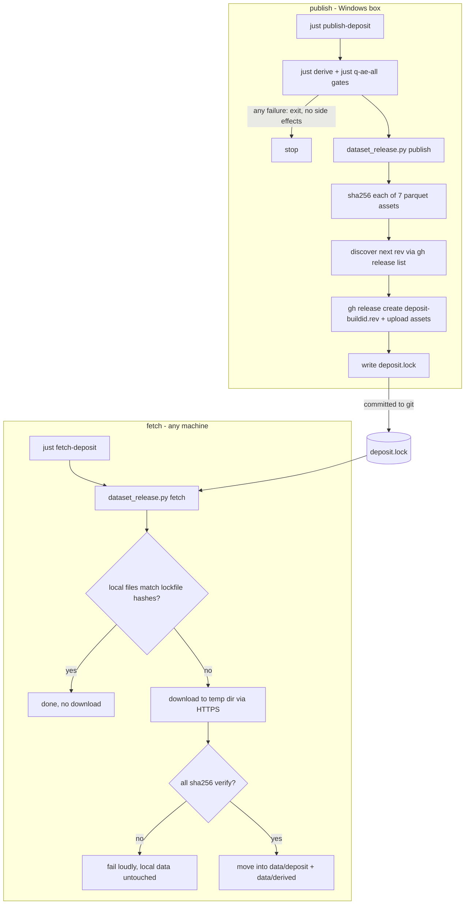

# Dataset Releases and Lockfile - Plan

## Goal Capsule

- **Objective:** Make the item-data parquet portable without ever entering git: publish deposit + derived as immutable per-buildid GitHub Releases from the Windows box, pin them with a committed lockfile, and fetch them on any machine.
- **Product authority:** this document; decisions confirmed with Ted 2026-07-11 (seeded from `docs/ideation/2026-07-11-item-db-direction-ideation.html`, idea 2, and BACKLOG "Sequenced roadmap" step 1).
- **Authority hierarchy:** Product Contract > Planning Contract > unit Approach notes. Repo conventions (justfile-first, uv-shebang scripts) override unit details on conflict.
- **Stop conditions:** publishing anything when a gate fails; modifying or deleting an existing release; committing parquet; changing CI workflows (out of scope).
- **Open blockers:** none.
- **Product Contract preservation:** unchanged, except Outstanding Questions' "Deferred to Planning" items are resolved into Planning Contract KTDs (resolved in place per prose-economy rules).

---

## Product Contract

### Summary

Two justfile recipes and one small committed file: `publish-deposit` (Windows) re-derives, gates on the seven acceptance queries, uploads the seven parquet artifacts to an immutable release tagged by Steam buildid plus publish revision, and writes `deposit.lock`; `fetch-deposit` (anywhere) downloads exactly what the lockfile pins and verifies checksums. First publish is the current build 19149150, which makes Mac development work immediately.

### Problem Frame

The deposit (~18 MB of parquet) and derived schema (~600 KB) are gitignored behind a "commit once the format stabilizes" gate with no defined trigger, because parquet does not delta-diff and each format change would bake a full blob into history. Meanwhile the artifacts exist only on the Windows box that ran extraction: no other machine, no CI job, and no future Pages deploy can consume them, and every downstream roadmap step (the `/items/` page, CI drift gates, Mac development) is blocked on the data having a fetchable home. The stability gate also cannot resolve itself: iterating on the format is exactly the period when committing is wrong, and after stabilizing there is still no reason to pay git for binary storage.

### Key Decisions

- **Releases, never commits.** Generated parquet never enters git at any stability level; the gitignore entries are permanent. Git holds only what diffs well: curation JSON, the lockfile, and later the balance diff. This supersedes the 2026-07-03 "commit once the format stabilizes" decision in `docs/deposit.md`.
- **Release both deposit and derived.** Consumers fetch and go with no derive step or Python dependency downstream. The publish recipe re-runs `just derive` and the acceptance gates immediately before upload, so the released derived artifacts are exactly the validated ones.
- **Immutable releases, revision-suffixed tags.** Format changes between game patches re-publish the same buildid under a new revision (for example `deposit-19149150.2`). Existing releases are never modified or deleted by tooling; the lockfile pins one exact tag.
- **Quiet internal artifact.** The releases exist for this repo's own tooling. The README notes they exist and that they are internal; no stability promise, no consumer documentation, no advertising. (Per BACKLOG's ratified tripwires, a first external consumer would reopen the repo-topology question.)
- **Publish is gated.** A publish that cannot pass `just derive` plus all seven acceptance queries fresh does not upload anything or touch the lockfile.
- **No local snapshot bookkeeping.** The release archive is the history; buildid-namespaced local derive output is dropped from scope. Between publishes, local iteration overwrites in place exactly as today.

### Requirements

**Publish**

- R1. `just publish-deposit` uploads the three deposit parquet files and four derived parquet files as assets of a new GitHub Release on this repo, tagged by Steam buildid plus publish revision. Census byproducts are not released.
- R2. Publish refuses to run unless `just derive` and all seven acceptance recipes (`just q-ae-all`) pass fresh against the artifacts being published; on failure nothing is uploaded and the lockfile is untouched.
- R3. Publish computes a sha256 per asset and writes `deposit.lock` (a small committed text file) recording the release tag, buildid, game version, and per-asset checksums.
- R4. Re-publishing an already-released buildid creates the next revision tag; the recipe never modifies or deletes an existing release.

**Fetch**

- R5. `just fetch-deposit` reads `deposit.lock`, downloads the pinned tag's assets into `data/deposit/` and `data/derived/`, and verifies every checksum; a mismatch or partial download fails loudly without leaving mismatched files in place as current data.
- R6. Fetch is idempotent: when local files already match the lockfile checksums, it does nothing.
- R7. After a fetch on a machine with no game install, the existing consumers work unchanged: `just q`, `just q-ae-all`, `just derive`, and the item browser prototype.

**Posture**

- R8. The README mentions the releases exist and that they are internal build artifacts for this repo, with no stability guarantee.
- R9. `data/deposit/` and `data/derived/` remain gitignored permanently.

### Acceptance Examples

- AE1. **Covers R1, R2, R3.** On the Windows box at build 19149150 with all gates passing, `just publish-deposit` creates release `deposit-19149150.1` (or the current revision) carrying exactly seven parquet assets, and `deposit.lock` in the working tree names that tag with a checksum per asset.
- AE2. **Covers R4.** After a schema change with no game patch, running publish again produces the next revision tag for the same buildid; the prior release and its assets are byte-identical to before.
- AE3. **Covers R2.** With one acceptance recipe failing, publish exits non-zero, no release or tag is created, and `deposit.lock` is unchanged.
- AE4. **Covers R5, R6, R7.** On a fresh clone with no `data/deposit/`, `just fetch-deposit` populates both data directories, `just q-ae-all` passes without running derive, and a second fetch downloads nothing.
- AE5. **Covers R5.** With a lockfile pointing at a tag whose assets do not match its checksums (or a truncated download), fetch reports the mismatch and the previously-current local data is not silently replaced by the bad files.

### Scope Boundaries

- **Deferred for later:** the balance-diff generator (next roadmap item; the release archive this feature creates is its input); any CI workflow changes (fetch makes a CI drift job possible; wiring it belongs to the `/items/` Pages work); retro-publishing builds older than 19149150; fetch warning when the lockfile's buildid is older than a newer published release (the lockfile is the single source of truth in v1).
- **Outside this feature's identity:** dataset-as-product positioning (public documentation, stability promises, consumer support) and any alternative artifact host (git LFS, external storage).

### Dependencies / Assumptions

- `gh` CLI is installed and authenticated on the Windows box (verified: gh 2.95.0, account tednaleid); fetch needs no `gh` and no authentication (public release assets over plain HTTPS).
- `meta.parquet` already carries `steam_buildid`, `game_version`, and row counts; checksum emission is new plumbing added by this feature.
- The repo is public, so release assets are publicly downloadable; the quiet-artifact posture (R8) is a stance, not an access control.
- Publishing extracted game-derived data follows existing community precedent (grimtools, GDLoot); the README's fan-project disclaimer covers the posture.

### Sources / Research

- `docs/deposit.md` - size-gate decision this feature supersedes ("about 18 MB total"; "gitignored for now, committed once the format stabilizes").
- `scripts/build_deposit.py:233-249` - meta_rows emission (schema_version, steam_buildid, game_version, row counts); `open_deposit()` at 282-289 exits 2 with pointed messages when the deposit is missing.
- `justfile` - `deposit_dir`/`derived_dir` single-variable resolution (lines 17-19); buildid read from `appmanifest_219990.acf` in the `deposit` recipe; `q-ae-all` aggregation.
- `.github/workflows/ci.yml` / `deploy.yml` - CI runs `just check` only; deploy ships `web/dist` only; neither touches item data (and this plan keeps it that way).
- `BACKLOG.md` - "Sequenced roadmap" step 1, ratified direction decisions, split tripwires.

---

## Planning Contract

### Key Technical Decisions

- KTD1. **Release mechanics live in a new standalone script, `scripts/dataset_release.py`** (uv shebang with a `duckdb` dependency matching `build_deposit.py`/`build_derived.py` — reading `meta.parquet` requires it; hashing and download use the stdlib), with `lock`, `publish`, and `fetch` subcommands. `build_deposit.py` stays a builder. The justfile recipes own orchestration: `publish-deposit` runs the gates (`just derive`, `just q-ae-all`) in bash, then calls the script for hashing, tag discovery, upload, and lockfile write; `fetch-deposit` calls the script directly.
- KTD2. **Tag scheme `deposit-<buildid>.<rev>`**, rev starting at 1. Publish discovers the next revision by listing existing `deposit-<buildid>.*` tags via `gh release list`/`gh api`; it never reuses, edits, or deletes a tag. The repository's immutable-releases setting is enabled before the bootstrap publish, so immutability is enforced by GitHub rather than by tooling convention. The release title carries buildid + game version; release notes body is minimal (generated one-liner with row counts from meta.parquet).
- KTD3. **`deposit.lock` is JSON at the repo root**, jq-friendly, holding: `tag`, `steam_buildid`, `game_version`, `schema_version`, `published_utc`, `download_base` (the release's `.../releases/download/<tag>` URL recorded at publish time), and `assets` — a list of `{name, dir, sha256, bytes}` where `dir` is `deposit` or `derived`. Storing `download_base` makes fetch a pure URL join with no host discovery; the GitHub coupling is accepted per the Product Contract assumption.
- KTD4. **Fetch needs no `gh` and no auth:** Python `urllib` downloads over HTTPS from `download_base`; uv resolves the script's own dependencies wherever it runs. `gh` is required only by `publish`.
- KTD5. **Atomic install on fetch:** download all assets to a temp directory, verify every sha256, then move into `data/deposit/` and `data/derived/` only after all pass. Fetch manages only the seven released files — census byproducts and any other local files in those directories are left alone. Idempotence check (R6) hashes existing local files against the lockfile before downloading anything.
- KTD6. **`publish --dry-run` runs everything except side effects:** gates already passed by the recipe, then hashing, revision discovery, and a print of the would-be lockfile JSON to stdout — no upload, no tag, no lockfile write. This is the testable path that keeps real releases out of development loops.

### High-Level Technical Design

Directional shape of the two flows (the lockfile is the only artifact crossing between them):

### Assumptions

- Existing Python in `scripts/` is verified through justfile acceptance recipes rather than a pytest suite; this feature follows that convention (command-level scenarios below, no new test framework).
- `git-bash` provides the bash the justfile recipes need on Windows, as with every existing recipe.

---

## Implementation Units

### U1. Release script core: hashing and lockfile emission

- **Goal:** `scripts/dataset_release.py` exists with the shared plumbing: asset manifest (the seven parquet files split by dir), sha256 hashing, lockfile serialization/deserialization, and a `lock` subcommand that writes `deposit.lock` for a given tag + download base.
- **Requirements:** R3.
- **Dependencies:** none.
- **Files:** `scripts/dataset_release.py` (new).
- **Approach:** uv-shebang script per repo convention (`#!/usr/bin/env -S uv run --script`) with a `duckdb` dependency; read buildid/game_version/schema_version via the existing `read_meta`/`open_deposit` helpers using `build_derived.py`'s import pattern. Hashing and download use the stdlib (`hashlib`, `json`, `urllib`). Asset list is fixed: `facts.parquet`, `labels.parquet`, `meta.parquet` from `data/deposit/`; `entities.parquet`, `stats.parquet`, `relations.parquet`, `families.parquet` from `data/derived/`. Missing asset = exit 2 with the existing pointed-message style.
- **Patterns to follow:** ABOUTME header comment; error style of `open_deposit()` (`scripts/build_deposit.py:282-289`); uv script deps block like `build_deposit.py`'s.
- **Test scenarios:** with all seven files present, `lock` writes a `deposit.lock` naming 7 assets with 64-hex sha256 and correct byte sizes; with `entities.parquet` deleted, `lock` exits 2 naming the missing file; lockfile round-trips through `jq .` cleanly.
- **Verification:** run the scenarios above against the live artifacts; `jq .tag deposit.lock` prints the tag.

### U2. Publish subcommand and `just publish-deposit` recipe

- **Goal:** Gated publish: recipe runs `just derive` + `just q-ae-all`, then `dataset_release.py publish` discovers the next revision tag, creates the release with the seven assets, and writes `deposit.lock`. `--dry-run` stops before side effects and prints the would-be lockfile.
- **Requirements:** R1, R2, R4; AE1, AE2, AE3.
- **Dependencies:** U1.
- **Files:** `scripts/dataset_release.py`, `justfile`.
- **Approach:** Recipe is bash with `set -euo pipefail`: gates first, then the script (KTD1). Script shells out to `gh` (`release list` for revision discovery per KTD2, `release create` with all assets in one call, `repo view --json` or the release URL for `download_base`). Publish (including `--dry-run`) exits 2 with a pointed message when `meta.parquet`'s `steam_buildid` is empty — the justfile's appmanifest grep is best-effort — directing the user to re-run `just deposit` with `GD_DIR` set. Any `gh` failure after tag creation should say plainly what exists and what didn't finish (partial-publish message), since releases are never auto-deleted.
- **Execution note:** develop against `--dry-run`; do exactly one real publish (the bootstrap, DoD item) rather than test-publishing repeatedly. If a scratch publish is unavoidable, use a `--draft` flag passed through to `gh release create` and delete the draft manually.
- **Test scenarios:** Covers AE3. with a deliberately failing gate (e.g., temporarily edit an oracle pin), the recipe exits non-zero before the script runs and `deposit.lock` is unchanged; with an empty `steam_buildid` in `meta.parquet`, both publish and `--dry-run` exit 2 naming the remedy (re-run `just deposit` with `GD_DIR` set); `publish --dry-run` on the healthy tree prints lockfile JSON whose tag is `deposit-19149150.1` when no prior release exists; with a mocked existing tag list containing `deposit-19149150.1`, revision discovery selects `.2` (testable via a `--assume-existing-tags` dev flag or by pointing discovery at a stub — implementer's choice); Covers AE1. one real publish creates the release with exactly 7 assets (verified via `gh release view`).
- **Verification:** AE1 and AE3 demonstrated live; AE2's byte-identical claim spot-checked by re-downloading a prior asset after a second publish (can be deferred to the first real format iteration).

### U3. Fetch subcommand and `just fetch-deposit` recipe

- **Goal:** Any machine with the repo can populate `data/deposit/` + `data/derived/` from the lockfile: idempotence check, HTTPS download to temp, verify-all-then-move, loud failure on mismatch.
- **Requirements:** R5, R6, R7; AE4, AE5.
- **Dependencies:** U1.
- **Files:** `scripts/dataset_release.py`, `justfile`.
- **Approach:** KTD4/KTD5: hash local files first and exit early when all match (R6); otherwise stdlib `urllib.request` downloads `download_base/<name>` per asset into a temp dir under the target data dir's parent (same volume, so the final move is cheap), verify every sha256, then move files into place individually (only the seven managed names). On any verify failure: remove temp dir, leave existing data untouched, exit 2 naming the failing asset.
- **Test scenarios:** Covers AE4. with `data/deposit/` and `data/derived/` moved aside, fetch populates both and `just q-ae-all` passes without running derive; immediately re-running fetch downloads nothing (assert via timing or a printed "up to date" line); Covers AE5. corrupt one byte of a lockfile sha256, fetch fails naming that asset and the previously-current files still pass their original hashes; delete one local parquet only — fetch re-downloads just what's needed (or all assets — either is acceptable, but the end state verifies).
- **Verification:** AE4 demonstrated on this Windows box by moving the data dirs aside and fetching; the true no-game-machine run (Ted's Mac) is the DoD's field check.

### U4. Documentation and posture

- **Goal:** The docs tell the truth about the new artifact home: `docs/deposit.md`'s size-gate decision is rewritten in place (releases, never commits), the refresh flow gains the publish step and the fetch alternative, README gets the quiet-artifact mention (R8), and BACKLOG's roadmap step 1 entry is trimmed to a pointer at this plan.
- **Requirements:** R8, R9.
- **Dependencies:** U2, U3 (documents the shipped behavior).
- **Files:** `docs/deposit.md`, `README.md`, `BACKLOG.md`, `ONBOARDING.md` (Common commands: publish/fetch one-liners).
- **Approach:** Living-docs rule: rewrite the superseded decision text in place, no "Update YYYY-MM-DD" strata. README wording keeps the fan-project posture: internal build artifact, no stability promise.
- **Test expectation:** none — documentation-only unit; verified by reading.
- **Verification:** `docs/deposit.md` no longer contains "committed once the format stabilizes"; README mentions releases as internal artifacts; `just --list` output matches the documented recipe names.

---

## Verification Contract

| Gate | Command | Proves |
|---|---|---|
| Derive + acceptance | `just derive` then `just q-ae-all` | data is healthy before/after any change; publish gate input |
| Dry-run publish | `just publish-deposit -- --dry-run` (or recipe-equivalent flag) | gates + hashing + revision discovery without side effects |
| Real publish (once) | `just publish-deposit` on the Windows box | AE1: release `deposit-19149150.<rev>` with 7 assets; lockfile written |
| Fetch round-trip | move `data/deposit`+`data/derived` aside, `just fetch-deposit`, `just q-ae-all` | AE4: fetch-only machine parity, no derive needed |
| Idempotence | second `just fetch-deposit` | AE4: downloads nothing |
| Web suite untouched | `just check` | 353 web tests unaffected (pre-commit hook runs this anyway) |

## Definition of Done

- All four units landed on `item-data-raw-deposit`, conventional-commit style, pre-commit hook passing.
- The repository's immutable-releases setting is enabled before the bootstrap publish.
- One real release exists: `deposit-19149150.<rev>` with exactly seven parquet assets; `deposit.lock` committed and pointing at it.
- AE1, AE3, AE4, AE5 demonstrated (AE3 via a temporary gate break, reverted; AE4 via data-dirs-moved-aside on this box); AE2 noted as deferred to the first real format iteration if not exercised.
- Field check available to Ted: `git pull && just fetch-deposit` on the Mac yields a working `just q-ae-all` — not blocking, but the point of the feature.
- Docs updated per U4; no CI workflow files touched; no parquet in git (`git status` clean of data dirs).
- No dead-end or experimental code left in the diff (dry-run/draft scaffolding either shipped intentionally or removed).
