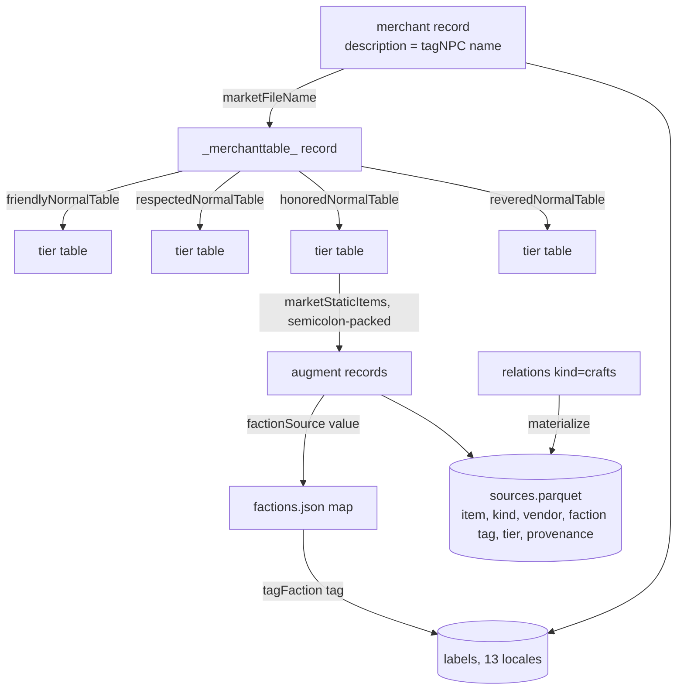

# Item Source Tier 1 - Plan

## Goal Capsule

- **Objective:** Answer "where do I get this item?" for faction augments and crafted gear: full source lines ("Sold by Falonestra (Coven of Ugdenbog), Honored") derived from the game's own vendor records, source edges in the derived schema, and a source facet in the item browser prototype.
- **Product authority:** this document; decisions confirmed with Ted 2026-07-11 (roadmap step 2 in BACKLOG.md; seeded from docs/ideation/2026-07-11-item-db-direction-ideation.html, idea 4).
- **Authority hierarchy:** Product Contract > Planning Contract > unit Approach notes. Repo conventions (justfile-first, uv-shebang scripts, curation drift guards) override unit details on conflict.
- **Stop conditions:** publishing a release when any acceptance gate fails; hand-curating data the derivation chain can produce; labeling any item "world drop"; changing CI workflows.
- **Open blockers:** none.
- **Product Contract preservation:** unchanged.

---

## Product Contract

### Summary

Derive vendor source edges from the merchant record chain (merchant to faction tier table to packed item list), attach them to the derived schema with provenance stamps, and surface them two ways in the prototype: a source line on the item card and a source facet (faction vendor / crafted / unsourced). Crafted-source lines come from the existing crafts edges. Ships as a new dataset release revision so every machine sees the edges.

### Problem Frame

Item cards show what an item does but not how to obtain it, and the community reference (grimtools) models only named-monster drops, so vendor and faction acquisition is invisible everywhere. The deposit already contains the game's own vendor configuration: merchants carry per-reputation-tier market tables whose packed item lists name the augments they sell. Nobody surfaces this data; the session that scoped this feature verified the chain end to end and found it covers 284 of the 292 faction-sourced augments.

### Key Decisions

- **Source lines are derived from game facts, not transcribed from the wiki.** The initially assumed 292-row wiki transcription is unnecessary: vendor, faction, and reputation tier all come from the merchant chain (the tier is encoded by which tier table lists the augment). The wiki is demoted to spot-check oracle in the acceptance gate.
- **Unsourced items stay silent.** This revises the BACKLOG's ratified "world drop" fallback: with tier-1 coverage, that label would be wrong for monster infrequents, quest rewards, and crafted gear. "World drop" appears only in roadmap step 3, when the loot walk can distinguish it.
- **Crafted counts as a source now.** The 707 existing crafts edges (blueprint to item) already answer the acquisition question for those items; displaying them costs no new extraction.
- **Provenance is stamped at birth.** Part of step 3's provenance decision is pulled forward: every source edge carries a qualifier from the vocabulary already named in BACKLOG (flat-fact for the derived chain, curated-oracle for anything hand-fixed). Step 3 extends the vocabulary; it does not retrofit tier-1 edges.
- **factionRequired is excluded.** Verified: those 128 facts gate monster spawns (proxy records), not item acquisition.

### Requirements

**Derivation**

- R1. Source edges are derived from the merchant chain: merchant record, its faction tier tables (friendly/respected/honored/revered), and their packed item lists. Each edge carries the selling vendor, the faction, and the reputation tier.
- R2. Display names resolve through label tags so all 13 locales work without new text extraction: merchant names via the merchant record's description tag, faction names via the tagFaction tags. The User-code-to-faction mapping is a curated file under data/item-curation/ with a drift guard.
- R3. Faction-sourced augments that appear in no vendor table (8 at build 19149150) fail the build loudly until each is either covered by a small curated entry or documented as deliberately unsourced.
- R4. Every source edge carries a provenance qualifier: flat-fact when fully derived, curated-oracle when hand-fixed.
- R5. New curation files follow the existing drift-guard convention: the build fails loudly when game vocabulary outgrows them.

**Display (item browser prototype)**

- R6. A faction augment's card shows one source line per selling vendor: vendor name, faction, and reputation tier.
- R7. An item with a crafts edge shows a crafted-source line naming its blueprint.
- R8. An item with no source edge shows no source line.
- R9. An item with multiple sources shows all of them (a card can carry both vendor and crafted lines).

**Facet**

- R10. The prototype gains a source facet with values faction vendor / crafted / unsourced, using the existing faceted-count rules; a multi-source item counts under each value it holds.

**Verification and publication**

- R11. A new acceptance recipe joins the AE gate: count pins at build 19149150 plus wiki-oracle spot checks of known augment cards (vendor, faction, tier exact-match).
- R12. Shipping includes publishing the next dataset release revision and committing the updated deposit.lock, so fetch-only machines and the browser see the edges.

### Acceptance Examples

- AE1. **Covers R1, R2, R6.** A faction augment listed in a faction's honored tier table shows "Sold by (that merchant's name) ((faction name)), Honored" on its card, with names matching the wiki oracle for that augment exactly.
- AE2. **Covers R3.** At build 19149150 the derivation accounts for all 292 faction-sourced augments: 284 via vendor tables, and the remaining 8 each resolved by curation or listed in a documented-exclusion check that fails when the set drifts.
- AE3. **Covers R7, R8, R9.** An item craftable from a blueprint shows its crafted line; an ordinary world-drop legendary with no edges shows no source line; an item with both vendor and crafts edges shows both lines.
- AE4. **Covers R10.** Selecting the "faction vendor" facet value filters to exactly the entities carrying vendor edges, and the facet counts obey the existing selection-aware rules.
- AE5. **Covers R11, R12.** `just q-ae-all` (including the new recipe) passes on a machine that only ran `just fetch-deposit` against the new release revision.

### Scope Boundaries

- **Deferred to roadmap step 3:** world-drop / monster-infrequent / quest-reward labeling, weighted drop chances, and any loot-table recursion. The tier tables are followed one deterministic hop; anything needing weights or recursion waits for the walker.
- **Deferred to roadmap step 4:** the production /items/ filter UI. The facet ships only in the throwaway prototype.
- **Outside this feature's identity:** linking out for item source (ratified: own everything a query can answer).

### Dependencies / Assumptions

- Verified at build 19149150: 292 factionSource facts, all under records/items/enchants/ (6 of them runes, treated identically); merchant faction tier tables cover 284 of them; crafts edges number 707; tagFaction labels exist in all 13 locales.
- Assumption: membership in a faction's tier-N market table means purchasable at reputation tier N; the wiki spot checks in R11 are the guard on this reading.
- Assumption: the faction name doubles as the location in the source line (faction vendors sit in their faction's hub); no separate area lookup in tier 1.
- The prototype remains English-only throwaway code; the i18n invariant applies when step 4 moves this into web/.

### Sources / Research

- BACKLOG.md "Sequenced roadmap" step 2 and "Direction decisions (ratified 2026-07-11)".
- docs/item-schema.md - derived schema tables this extends; scripts/build_derived.py builds relations (kinds today: applies_to, crafts, reagent, set_member, grants_skill, spawns_pet) and enforces curation drift guards.
- Verified deposit queries (session 2026-07-11): merchant records carry marketStaticItems and per-tier tables under records/creatures/npcs/merchants/factiontables/; merchant display names resolve via their description tag; the scoped-out factionRequired facts live on spawn proxies.
- itemdb.html - existing facet groups (domain, gear_type, rarity, expansion) and selection-aware count rules the source facet joins.

---

## Planning Contract

### Key Technical Decisions

- KTD1. **Source data gets its own derived table, `sources.parquet`.** The relations table is a bare (src, kind, dst) triple with no room for the per-edge attributes a source line needs. Columns: item record, kind (faction_vendor or crafted), vendor record, vendor name tag, faction tag, tier, provenance. Relations is untouched.
- KTD2. **The derivation chain is four deterministic joins, no recursion, no weights.** Merchant record, its marketFileName, the referenced merchant-table record's tier keys (friendlyNormalTable / respectedNormalTable / honoredNormalTable / reveredNormalTable), the tier-table record's semicolon-packed marketStaticItems. The tier comes from which tier key referenced the table; the faction comes from the item's own factionSource value through the curated map; the vendor name comes from the merchant record's description tag.
- KTD3. **One new curation file, `data/item-curation/factions.json`, with two drift guards.** It holds the factionSource-value-to-tagFaction map (13 rows at build 19149150: 12 User codes plus Survivors) and the pinned excluded-augments list (the 8 template blanks). Guard 1: any factionSource value missing from the map fails the build. Guard 2: the set of faction-sourced augments with no vendor row must equal the pinned exclusion list exactly, so a real augment losing vendor coverage or a blank gaining it fails loudly.
- KTD4. **Crafted rows are materialized into sources.parquet from the existing crafts edges.** Consumers answer "sources of item X" from one table with display-ready tags; the blueprint's name tag is carried on the row. Crafted rows reuse the vendor columns for the blueprint (record and name tag) and leave faction tag and tier empty; docs/item-schema.md states this column contract. Provenance for both kinds is flat-fact; curated-oracle is reserved for any future hand-fixed row.
- KTD5. **Tier is stored as a stable enum (friendly / respected / honored / revered); display naming is the consumer's job.** The prototype hardcodes English tier words (it is exempt throwaway code). Localized tier display, if the game exposes reputation-tier tags, is a step-4 concern and a known limitation until then.
- KTD6. **The release asset manifest grows from 7 to 8.** scripts/dataset_release.py's ASSETS tuple gains sources.parquet under derived; deposit.lock and fetch pick it up automatically since the tuple is the single source of truth. Docs that say "seven parquet assets" or "the four derived files" are updated in the same unit.

### High-Level Technical Design

### Assumptions

- Derived-schema code is verified through justfile acceptance recipes, not a pytest suite; this feature follows that convention.
- The wiki-oracle rows in the new acceptance recipe are transcribed by the implementer and spot-checked by Ted, like the existing requirement and APS card oracles.
- Multiple merchants may reference the same merchant table; each produces its own vendor row (R9 allows multiple lines).

---

## Implementation Units

### U1. Sources builder and faction curation

- **Goal:** `just derive` emits `sources.parquet` alongside the existing four derived tables: faction_vendor rows from the merchant chain and crafted rows materialized from crafts edges, with the factions.json curation and both drift guards.
- **Requirements:** R1, R2, R3, R4, R5.
- **Dependencies:** none.
- **Files:** `scripts/build_derived.py`, `data/item-curation/factions.json` (new).
- **Approach:** New build_sources step following the build_relations SQL-block pattern (scripts/build_derived.py:433-494): unnest the tier tables' packed lists per KTD2, join vendor and faction attribution, union the crafted projection per KTD4, write with the same COPY convention as the other tables. Curation loads and guards go through the existing run_guards pattern (build_derived.py:135-175). Populate factions.json by querying the distinct factionSource values and mapping each to its tagFaction tag; the 8 template blanks are the initial exclusion list.
- **Patterns to follow:** per-kind INSERT blocks in build_relations; drift-guard failure style (CURATION DRIFT message, SystemExit); curation JSON shape of `data/item-curation/gear-types.json`.
- **Test scenarios:** Covers AE2. at build 19149150, sources.parquet holds vendor rows for exactly 284 distinct augments and the exclusion guard passes; editing the exclusion list (drop one blank) fails the build naming the drifted record; removing a map entry from factions.json fails the build naming the unmapped factionSource value; every faction_tag and vendor name tag on a sources row resolves in labels for locale en; crafted rows cover the same distinct items as relations kind=crafts; one hand-checked chain (a known augment) yields the expected vendor record, tier, and faction tag.
- **Verification:** `just derive` succeeds and prints the new table's row count; the scenario queries above run via `just q`.

### U2. Acceptance recipe: faction sources

- **Goal:** A new oracle-gated recipe `q-ae8-faction-sources` joins the `q-ae-all` gate, pinning the derivation against counts and transcribed wiki cards.
- **Requirements:** R11; AE1, AE2.
- **Dependencies:** U1.
- **Files:** `scripts/derived_queries/ae8_faction_sources.sql` (new), `justfile`.
- **Approach:** Same gated-SQL shape as the existing ae*.sql files (checks CTE gating output, fail on empty): pin 284 distinct vendor-sourced augments, pin the per-tier row distribution, and exact-match 3 to 5 wiki-transcribed rows (augment name, vendor name, faction, tier). Recipe wiring mirrors q-ae1 through q-ae7 via `_q-derived`, and q-ae-all gains the new dependency.
- **Execution note:** Transcribe the oracle rows from grimtools or the wiki during implementation and have Ted spot-check them, per the existing card-oracle convention.
- **Test scenarios:** Covers AE1. the recipe passes at build 19149150 with the transcribed oracles; temporarily altering one pinned count makes it exit non-zero (then revert); `just q-ae-all` runs it as part of the gate.
- **Verification:** `just q-ae8-faction-sources` and `just q-ae-all` both pass.

### U3. Prototype source lines and facet

- **Goal:** The item browser shows source lines on cards (vendor lines per R6, crafted line per R7, silence per R8, multiple per R9) and gains the source facet (R10).
- **Requirements:** R6, R7, R8, R9, R10.
- **Dependencies:** U1.
- **Files:** `itemdb.html`.
- **Approach:** Register and fetch `data/derived/sources.parquet` beside the existing three files; join source rows to items at load; render lines on the card (English constants, prototype is exempt from the i18n invariant). The source facet is the first set-valued field: an item's facet value set is {faction vendor} and/or {crafted}, or {unsourced} when empty, so the facet match and count logic handles a set membership test where the four existing fields test a scalar, and counts count items, not source rows.
- **Test scenarios:** Covers AE3, AE4. a faction augment card shows "Sold by (vendor) ((faction)), (Tier)" with values matching sources.parquet; a blueprint-crafted item shows its crafted line; an item with no rows shows no source section; selecting "faction vendor" filters to exactly the items with vendor rows and other facet counts recompute per the existing rules; an item that is both crafted and vendor-sold appears under either selection.
- **Verification:** `just item-browser`, manual check of one card per case above; counts in the source facet match `just q` counts over sources.parquet.

### U4. Release manifest, docs, and ship

- **Goal:** sources.parquet becomes the eighth release asset, the docs tell the truth about the new table, and the feature ships as release revision deposit-19149150.2 with the lockfile committed.
- **Requirements:** R12; AE5.
- **Dependencies:** U1, U2, U3.
- **Files:** `scripts/dataset_release.py`, `docs/item-schema.md`, `docs/deposit.md`, `BACKLOG.md`, `justfile` (comments only).
- **Approach:** Add sources.parquet to the ASSETS tuple (derived dir); sweep asset-count and recipe-count language ("seven parquet assets", "the four derived files", the justfile's "All seven derived acceptance queries" comments, docs/item-schema.md's AE list) wherever it appears; document the sources table, its crafted-row column contract (KTD4), and factions.json curation in docs/item-schema.md per the living-docs rule; trim BACKLOG roadmap step 2 to a shipped pointer. Then `just publish-deposit` (gates rerun by the recipe), commit deposit.lock, and verify a fetch round-trip.
- **Test scenarios:** Covers AE5. after publish, on this box with both data dirs moved aside, `just fetch-deposit` pulls 8 assets and `just q-ae-all` (including q-ae8) passes without running derive; a second fetch reports up to date.
- **Verification:** `gh release view deposit-19149150.2` lists 8 assets; deposit.lock names 8; docs contain no stale seven-asset or four-file claims.

---

## Verification Contract

| Gate | Command | Proves |
|---|---|---|
| Derive with sources | `just derive` | sources.parquet builds; curation drift guards pass |
| Acceptance gate | `just q-ae-all` | all eight recipes pass, including the new faction-sources oracles |
| Prototype check | `just item-browser` (manual) | card lines and source facet behave per AE3/AE4 |
| Publish | `just publish-deposit` | release deposit-19149150.2 with 8 assets; lockfile written |
| Fetch round-trip | data dirs aside, `just fetch-deposit`, `just q-ae-all` | AE5: fetch-only machine parity including sources |
| Web suite untouched | `just check` | web tests unaffected (pre-commit hook runs this anyway) |

## Definition of Done

- All four units landed on `item-data-raw-deposit`, conventional-commit style, pre-commit hook passing.
- `just derive` emits five derived tables; factions.json guards fire on synthetic drift (demonstrated once, reverted).
- `just q-ae-all` includes q-ae8-faction-sources and passes; Ted has spot-checked the transcribed oracle rows.
- The prototype shows vendor, crafted, and silent cards correctly and the source facet filters with live counts.
- Release `deposit-19149150.2` exists with exactly eight parquet assets; `deposit.lock` committed and pointing at it; fetch round-trip demonstrated.
- Docs updated per U4; no CI workflow changes; no parquet in git.
- Follow-up noted in BACKLOG, not built here: whether template-blank augments should leave the entities table entirely.
